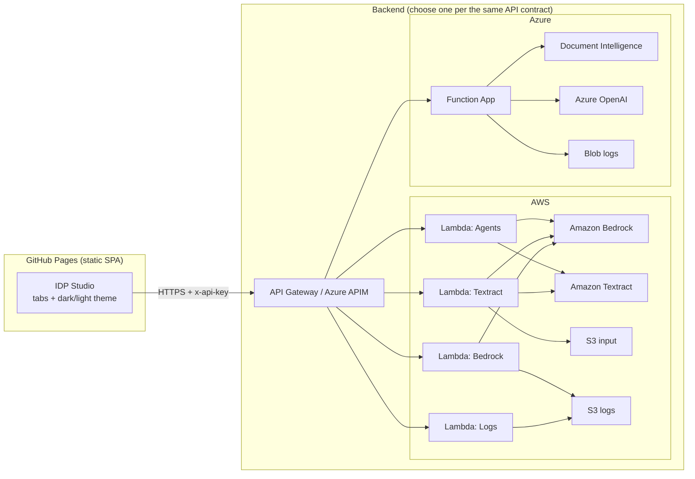
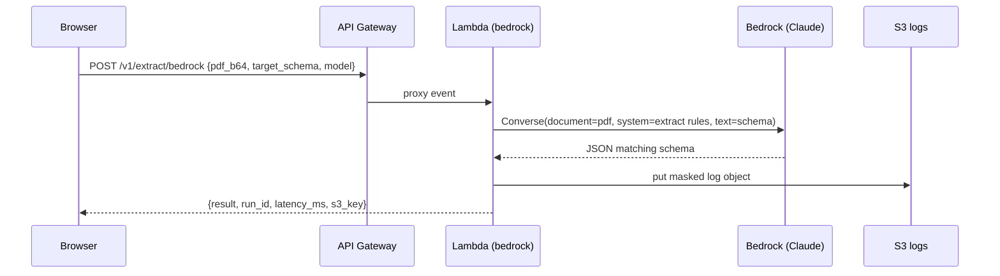
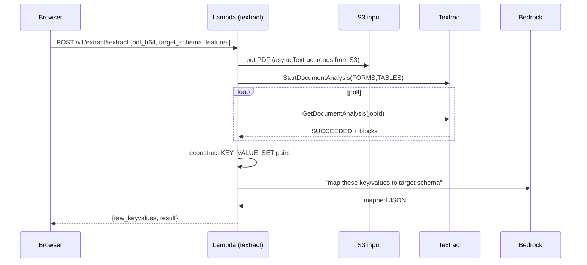
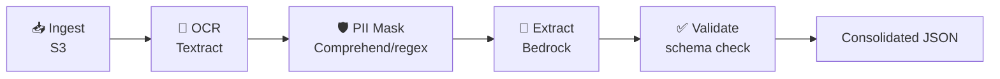
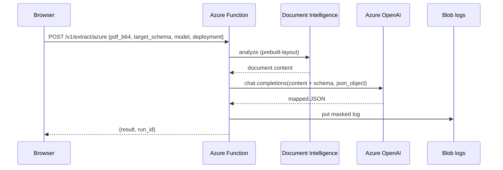

# IDP Studio — Documentation

End-to-end **Intelligent Document Processing (IDP)** for insurance broker /
underwriting documents (medical questionnaires, IDP/KYC identity pages,
financials and free text for high-net-worth clients). The app extracts the
content of an uploaded PDF and returns it shaped to a caller-supplied
**Target JSON** schema.

---

## 1. Purpose

Underwriting teams receive broker PDFs in many shapes. This tool turns those
PDFs into clean, structured JSON that downstream systems can consume — using
four interchangeable extraction strategies:

| Tab | Strategy | Services |
|-----|----------|----------|
| ① Bedrock | Send the PDF straight to a foundation model that reads + maps in one shot | AWS Bedrock (Claude) |
| ② Textract | OCR + forms/tables, then map raw key/values to the schema | AWS Textract → Bedrock |
| ③ Agentic | A pipeline of specialised agents, each visible in the UI | Textract + Comprehend + Bedrock |
| ④ Azure | Mirror of the AWS flow on the Azure stack | Azure Document Intelligence → Azure OpenAI |

Two cross-cutting tabs: **⑤ Logs** (every run is stored in S3 / Blob) and
**⑥ Documentation** (this page).

> **PII handling.** Documents contain PII (names, IDs, emails, phones,
> addresses). PII is masked before any log object is written when the
> *Mask PII* option is enabled (default on). Input PDFs auto-expire from S3
> after 1 day; logs after 30 days.

---

## 2. High-Level Architecture



The **frontend is 100% static** (hostable on GitHub Pages) and never holds
cloud credentials. It calls a single API contract (`api/openapi.yaml`) that is
implemented by **either** AWS **or** Azure. With no API URL configured the app
runs in **Mock mode** so it is fully demoable with zero infrastructure.

---

## 3. Low-Level Design

### 3.1 Tab ① — Bedrock (direct)



### 3.2 Tab ② — Textract → Bedrock mapping



### 3.3 Tab ③ — Agentic pipeline



Each agent exposes its own `input`/`output`, rendered as a box in the UI. In
the reference Lambda the agents run sequentially in-process; for production
scale the same five steps map onto **AWS Step Functions** (one state per agent)
with the orchestrator Lambda replaced by the state machine.

### 3.4 Tab ④ — Azure mirror



---

## 4. API Contract

One contract, two implementations. Full spec: [`api/openapi.yaml`](../api/openapi.yaml).

| Method | Path | Purpose | AWS | Azure |
|--------|------|---------|-----|-------|
| POST | `/v1/extract/bedrock` | Direct model extraction | ✅ | — |
| POST | `/v1/extract/textract` | OCR + map | ✅ | — |
| POST | `/v1/agents/run` | Agentic pipeline | ✅ | — |
| POST | `/v1/extract/azure` | Document Intelligence + OpenAI | — | ✅ |
| GET  | `/v1/logs` | List stored log entries | ✅ | ✅ |

**Auth:** optional `x-api-key` header (shared secret). **CORS:** locked to your
GitHub Pages origin when you set `allowed_origin`.

Request body (shared shape):

```json
{
  "filename": "broker_application.pdf",
  "document_base64": "<base64 PDF>",
  "target_schema": "{ \"applicant\": { \"full_name\": \"\" } }",
  "mask_pii": true,
  "model": "anthropic.claude-sonnet-4-6-v1:0"
}
```

---

## 5. Security & Compliance Notes

- **No secrets in the browser.** All cloud calls happen server-side (Lambda /
  Function). The SPA only knows the API URL and an optional API key.
- **PII masking** before log persistence (email, phone, long numeric IDs).
- **Least-privilege IAM** — the Lambda role can only touch its two buckets,
  Bedrock invoke, and Textract analyze.
- **Lifecycle expiry** — input PDFs deleted after 1 day, logs after 30 days.
- **Private buckets** — all S3 public access blocked; logs are served only
  through the authenticated `/v1/logs` endpoint.
- For production: enable WAF on API Gateway, KMS encryption on buckets, and a
  proper Lambda authorizer / Cognito instead of the shared-secret key.

---

## 6. Cost / Free-Tier

| Service | Free tier | Notes |
|---------|-----------|-------|
| Lambda | 1M requests/mo | well within demo usage |
| API Gateway (HTTP) | 1M calls/mo (12 mo) | cheap thereafter |
| S3 | 5 GB | lifecycle rules keep it tiny |
| Textract | 1,000 pages/mo (3 mo) | then per-page |
| Bedrock | pay-per-token | no free tier; pennies per doc on Haiku/Sonnet |
| Azure Functions | 1M executions/mo | consumption plan |
| Document Intelligence | F0 free SKU | 500 pages/mo |
| Azure OpenAI | pay-per-token | requires access approval |

See `DEPLOYMENT.md` for step-by-step setup on brand-new free-tier accounts.
