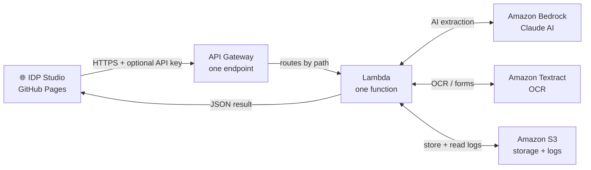
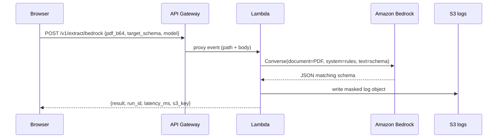
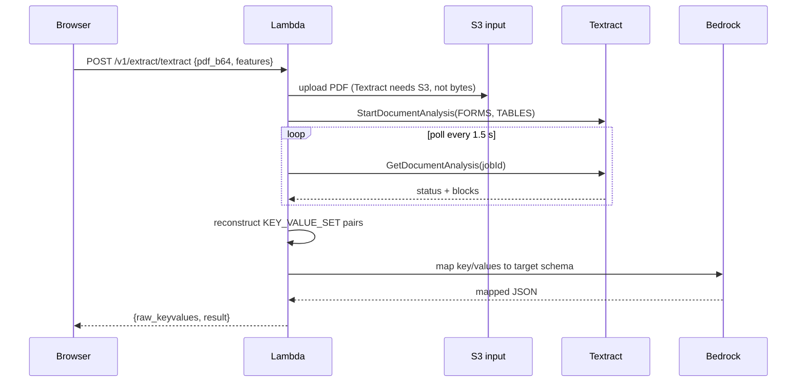
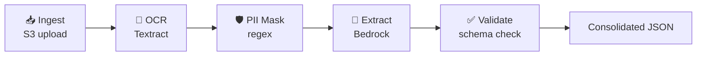

# IDP Studio

Upload a PDF broker document, get clean structured JSON back — powered by AWS AI services. The app runs as a free static website on GitHub Pages; the AI processing happens in your own AWS account via a simple backend you deploy in one command.

---

## AWS Services Used

| Service | What it does in this app |
|---------|--------------------------|
| **Amazon API Gateway** | Receives HTTPS requests from the browser. Acts as the secure front door — handles CORS, throttling, and routes each call to the Lambda. |
| **AWS Lambda** | One Python function that handles all four API routes. It reads the PDF, calls Bedrock or Textract, writes a log to S3, and returns the result. No servers to manage. |
| **Amazon Bedrock** | The AI brain. You send it a PDF and a JSON schema; it reads the document and returns the data shaped to your schema. Uses Anthropic Claude models. |
| **Amazon Textract** | Specialist OCR service. Great at pulling key/value pairs and tables from structured forms (things like tick-boxes, form fields, tables). |
| **Amazon S3** | Object storage. Stores uploaded PDFs temporarily (deleted after 1 day) and keeps processing logs for 30 days. |

---

## How It Works



The browser sends a base64-encoded PDF and a **Target JSON schema** (the shape of data you want back). The Lambda decides which AWS service to use based on which tab you clicked, then returns the populated JSON.

> **No credentials in the browser.** The static website only knows your API Gateway URL and an optional API key. All AWS calls happen inside the Lambda.

---

## The 4 Extraction Strategies

| Tab | What it does | Best for |
|-----|-------------|----------|
| ① **Bedrock** | Sends the PDF directly to Claude. One step, highest accuracy. | Any PDF — free text, mixed content |
| ② **Textract** | OCR extracts raw key/values from forms, then Claude maps them to your schema. Two steps. | Structured forms, tick-boxes, tables |
| ③ **Agentic** | Full pipeline: Ingest → OCR → PII Mask → Extract → Validate. Each step is shown in the UI. | Demo / understanding the flow |
| ④ **Azure** | Same idea but running on Azure (Document Intelligence + Azure OpenAI). | Azure environments |

Both ① and ② produce the same JSON output — they just take different paths to get there.

---

## Deployment — Run It on Your AWS Account

### What gets created

Running `terraform apply` creates exactly these resources (and nothing else):

```
2 × S3 bucket
    idp-studio-XXXXXX-input   — uploaded PDFs (auto-deleted after 1 day)
    idp-studio-XXXXXX-logs    — processing logs (auto-deleted after 30 days)

1 × IAM role + inline policy
    idp-studio-XXXXXX-lambda-role

1 × Lambda function
    idp-studio-XXXXXX-handler  (Python 3.12, 512 MB, 3-min timeout)

1 × API Gateway (HTTP API v2)
    idp-studio-XXXXXX-api
    Routes:
      POST /v1/extract/bedrock
      POST /v1/extract/textract
      POST /v1/agents/run
      GET  /v1/logs

1 × CloudWatch log group
    /aws/lambda/idp-studio-XXXXXX-handler  (14-day retention)
```

`XXXXXX` is a random 6-char hex suffix so bucket/function names are globally unique. Terraform will show ~19 plan items (S3 public-access blocks and lifecycle configs count separately) but the meaningful resources are the 6 above.

---

### Before you start — enable Bedrock model access

This is the most commonly missed step. Without it, every Bedrock call returns `AccessDeniedException`.

1. Sign in to the AWS Console.
2. Search for **Bedrock** → make sure the region (top-right) matches your deploy region (default: `us-east-1`).
3. Left menu → **Model access** → **Manage model access**.
4. Enable **Anthropic Claude** models (Haiku, Sonnet, Opus). Approval is instant.

---

### Step-by-step deployment

**Prerequisites (install once):**

| Tool | Install (Windows) | Verify |
|------|------------------|--------|
| Terraform | `winget install Hashicorp.Terraform` | `terraform -version` |
| AWS CLI | `winget install Amazon.AWSCLI` | `aws --version` |

**1. Create an AWS user for Terraform**

1. AWS Console → **IAM** → **Users** → **Create user** (name it `terraform`).
2. Attach policy: **AdministratorAccess** (simplest for setup; tighten later).
3. Open the user → **Security credentials** → **Create access key** → choose **CLI**.
4. Save the Access Key ID and Secret Access Key.

**2. Configure the AWS CLI**

```bash
aws configure
# AWS Access Key ID:     AKIA…
# AWS Secret Access Key: …
# Default region:        us-east-1
# Output format:         json
```

**3. Deploy the backend**

```bash
cd terraform/aws

# Copy the example config and edit if you want (all defaults work as-is)
cp terraform.tfvars.example terraform.tfvars

terraform init      # download providers (~1 min, one time)
terraform plan      # preview what will be created
terraform apply     # type 'yes' — takes ~30 seconds
```

When it finishes you'll see:

```
api_base_url = "https://abc123.execute-api.us-east-1.amazonaws.com/prod"
input_bucket = "idp-studio-a1b2c3-input"
log_bucket   = "idp-studio-a1b2c3-logs"
```

Copy the `api_base_url`.

**4. Connect the UI**

1. Open IDP Studio (GitHub Pages URL or `index.html` locally).
2. Click the ⚙️ gear icon top-right.
3. Paste `api_base_url` into **API base URL**. Save.
4. The pill top-right turns green (**Live mode**).
5. Upload a PDF on any tab and click **Run**.

**5. (Optional) Lock it down**

Edit `terraform.tfvars`:

```hcl
# Only allow your GitHub Pages site to call the API
allowed_origin = "https://YOUR_USERNAME.github.io"

# Add a shared secret — paste the same value in the app's API key field
api_key = "choose-a-long-random-string"
```

Then run `terraform apply` again to update.

**6. Host the UI on GitHub Pages**

1. Fork this repo on GitHub.
2. Go to repo **Settings** → **Pages** → Source: **Deploy from a branch** → branch `main`, folder `/` (root).
3. GitHub Pages URL will be `https://YOUR_USERNAME.github.io/REPO_NAME`.
4. Use that URL as your `allowed_origin` in tfvars.

**Tear down (stop all costs)**

```bash
terraform destroy   # type 'yes'
```

This deletes everything Terraform created. S3 buckets are force-destroyed (contents deleted too).

---

### Cost estimate

| Service | Free tier | Typical POC cost |
|---------|-----------|-----------------|
| Lambda | 1M requests/month free forever | ~$0 |
| API Gateway (HTTP) | 1M calls/month free (12 months) | ~$0 |
| S3 | 5 GB free | ~$0 |
| Textract | 1,000 pages/month free (3 months) | ~$0 |
| **Bedrock** | **No free tier** | ~$0.01–0.05 per document (Sonnet) |
| CloudWatch Logs | 5 GB free | ~$0 |

Bedrock is the only real cost. One document extraction with Claude Sonnet 4.6 is roughly **$0.01–0.05** depending on document size. Use Claude Haiku for cheapest testing.

---

### Troubleshooting

| Symptom | Fix |
|---------|-----|
| App still shows "Mock mode" | You didn't save the API base URL, or saved it with a trailing slash. |
| CORS error in browser console | Set `allowed_origin` in tfvars to your exact GitHub Pages URL and re-run `terraform apply`. |
| `AccessDeniedException` from Bedrock | Enable Claude model access in Bedrock console (same region as your deploy). |
| Textract times out | Large multi-page PDFs take longer. The Lambda polls for up to ~30 s. Use smaller test PDFs. |
| `NoSuchBucket` error | Terraform apply didn't complete. Re-run it. |

---

<details>
<summary>🔬 Deep Technical Details (click to expand)</summary>

<h2>Architecture — how the single Lambda handles all routes</h2>

<p>The Lambda reads the HTTP method and path from the API Gateway event and dispatches to the right handler function:</p>

<pre><code>def handler(event, context):
    method = event["requestContext"]["http"]["method"]
    path   = event["requestContext"]["http"]["path"]

    if path == "/v1/extract/bedrock"  and method == "POST": return handle_bedrock(event)
    if path == "/v1/extract/textract" and method == "POST": return handle_textract(event)
    if path == "/v1/agents/run"       and method == "POST": return handle_agents(event)
    if path == "/v1/logs"             and method == "GET":  return handle_logs(event)
</code></pre>

<p>API Gateway HTTP API (v2) with <code>payload_format_version = "2.0"</code> passes a clean event structure. CORS preflight (OPTIONS) is handled by API Gateway itself before the Lambda is even invoked.</p>

<h2>Tab ① — Bedrock direct extraction</h2>



<p>Uses <code>bedrock.converse()</code> with the <code>document</code> content block — Claude reads the raw PDF bytes directly. No OCR step needed.</p>

<h2>Tab ② — Textract → Bedrock mapping</h2>



<p>Textract async API requires the document to come from S3, hence the upload step. The Lambda polls until the job succeeds (usually 5–15 s per page).</p>

<h2>Tab ③ — Agentic pipeline</h2>



<p>All five steps run sequentially inside the same Lambda invocation. Each step returns an <code>{input, output}</code> object that the UI renders as a visible agent box. In a production system these map cleanly onto AWS Step Functions states.</p>

<h2>API Contract</h2>

<p>Full spec: <code>api/openapi.yaml</code>. Summary:</p>

<table>
<tr><th>Method</th><th>Path</th><th>Purpose</th></tr>
<tr><td>POST</td><td>/v1/extract/bedrock</td><td>Direct PDF → Bedrock extraction</td></tr>
<tr><td>POST</td><td>/v1/extract/textract</td><td>Textract OCR → Bedrock mapping</td></tr>
<tr><td>POST</td><td>/v1/agents/run</td><td>Full 5-step agentic pipeline</td></tr>
<tr><td>GET</td><td>/v1/logs</td><td>List S3 log entries</td></tr>
</table>

<p><strong>Request body</strong> (all POST routes share this shape):</p>

<pre><code>{
  "filename":        "broker.pdf",
  "document_base64": "&lt;base64 PDF bytes&gt;",
  "target_schema":   "{ \"full_name\": \"\", \"dob\": \"\" }",
  "mask_pii":        true,
  "model":           "anthropic.claude-3-5-sonnet-20241022-v2:0"
}
</code></pre>

<p><strong>Auth:</strong> send the optional shared secret as header <code>x-api-key</code>.</p>

<h2>PII Masking</h2>

<p>Before any log object is written to S3, <code>common.py:mask_pii()</code> replaces email addresses, phone numbers, and long numeric IDs with <code>[EMAIL]</code>, <code>[PHONE]</code>, <code>[ID]</code>. This runs on both the request data and the extracted result when <code>mask_pii: true</code> (default).</p>

<h2>Security notes</h2>

<ul>
<li><strong>No secrets in the browser.</strong> All AWS calls happen inside Lambda.</li>
<li><strong>Least-privilege IAM.</strong> The Lambda role can only touch its two S3 buckets, call Bedrock Converse, and call Textract analyze.</li>
<li><strong>Private S3 buckets.</strong> All public access is blocked. Log objects are only accessible through the <code>/v1/logs</code> endpoint.</li>
<li><strong>Lifecycle expiry.</strong> Input PDFs deleted after 1 day; logs after 30 days.</li>
<li><strong>Throttling.</strong> API Gateway is set to 10 concurrent / 20 req/s — enough for a demo, blocks runaway loops.</li>
<li><strong>Production hardening:</strong> add a WAF to the API Gateway, KMS encryption on S3 buckets, and replace the shared-secret key with a proper Cognito authorizer.</li>
</ul>

<h2>File layout</h2>

<pre><code>terraform/aws/
  main.tf                  — all infra (7 resources)
  variables.tf             — input variables
  outputs.tf               — api_base_url + bucket names
  terraform.tfvars.example — copy → terraform.tfvars, edit
  lambda/
    handler.py             — single entry point, routes all 4 paths
    common.py              — shared: CORS headers, PII mask, S3 log writer
  build/
    lambda.zip             — generated by Terraform (do not edit)
</code></pre>

</details>
