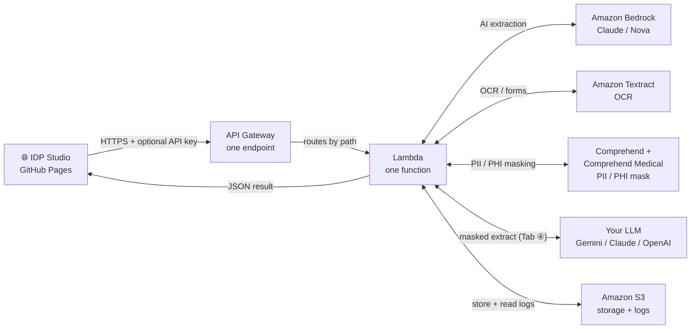
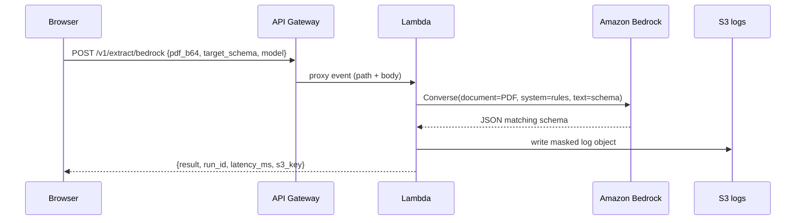
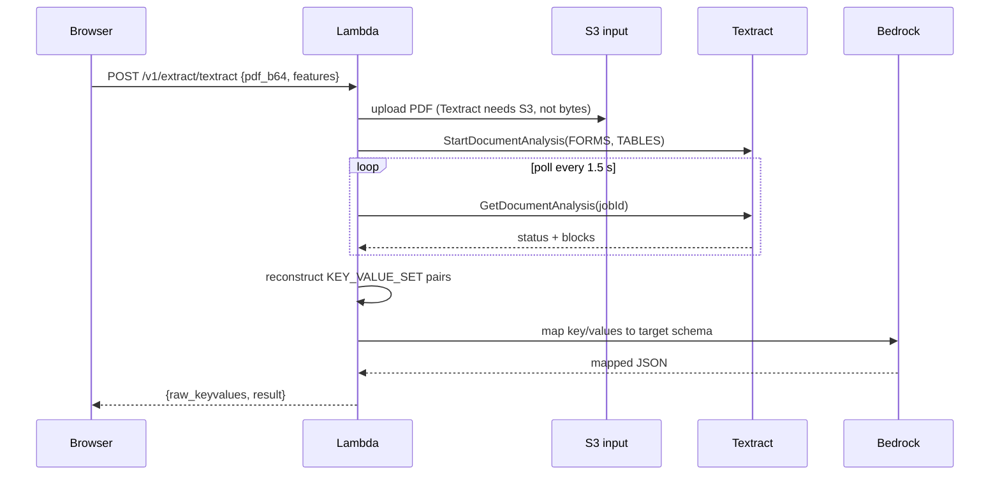
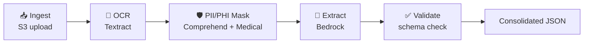
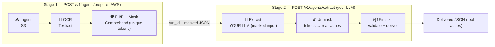

# IDP Studio

Upload a PDF broker document, get clean structured JSON back — powered by AWS AI services. The app runs as a free static website on GitHub Pages; the AI processing happens in your own AWS account via a simple backend you deploy in one command.

---

## AWS Services Used

| Service | What it does in this app |
|---------|--------------------------|
| **Amazon API Gateway** | Receives HTTPS requests from the browser. Acts as the secure front door — handles CORS, throttling, and routes each call to the Lambda. |
| **AWS Lambda** | One Python function that handles every API route (Bedrock, Textract, agentic, prepare/extract, logs). It reads the PDF, calls the right AWS services (and, for Tab ④, your external LLM), writes a log to S3, and returns the result. No servers to manage. |
| **Amazon Bedrock** | The AI brain. You send it a PDF and a JSON schema; it reads the document and returns the data shaped to your schema. Uses Anthropic Claude / Amazon Nova models. |
| **Amazon Textract** | Specialist OCR service. Great at pulling key/value pairs and tables from structured forms (things like tick-boxes, form fields, tables). |
| **Amazon Comprehend** | Detects **PII** (names, emails, phones, addresses, IDs) in the extracted text via `DetectPiiEntities`. Used by the agentic pipelines to mask before extraction. Existing managed model — no training. |
| **Amazon Comprehend Medical** | Detects **PHI** (protected health info) via `DetectPHI` for medical questionnaires. Optional per-run toggle (pricier). Existing managed model — no training. |
| **Amazon S3** | Object storage. Stores uploaded PDFs + the reversible mask context temporarily (deleted after 1 day) and keeps processing logs for 30 days. |

---

## How It Works



The browser sends a base64-encoded PDF and a **Target JSON schema** (the shape of data you want back). The Lambda decides which AWS service to use based on which tab you clicked, then returns the populated JSON.

> **No credentials in the browser.** The static website only knows your API Gateway URL and an optional API key. All AWS calls happen inside the Lambda.

---

## The Extraction Strategies

| Tab | What it does | Best for |
|-----|-------------|----------|
| ① **Bedrock** | Sends the PDF directly to a foundation model. One step, highest accuracy. | Any PDF — free text, mixed content |
| ② **Textract** | OCR + forms/tables analysis — returns **key/values and tables as JSON**. No LLM. Optionally fuzzy-maps the key/values onto your Target JSON schema (deterministic difflib matching, still no model). | Structured forms, tick-boxes, tables |
| ③ **Agentic (AWS Bedrock)** | Pipeline: Ingest → OCR (Textract) → PII/PHI Mask (Comprehend) → Extract (Bedrock) → Validate. Each step shows its own input/output; if Bedrock access isn't enabled, steps 1–3 still complete and step 4 reports the error. | Demo / understanding the flow |
| ④ **Agentic (Your LLM)** | Same pipeline as ③ but step 4 calls **your own external model** — Google Gemini, Anthropic Claude, or any OpenAI-compatible endpoint (key entered in the UI). Adds a 6th *Finalize* step. AWS still does OCR + PII/PHI masking; only the masked key/values leave for your LLM. Use when you can't/don't want to use AWS Bedrock. | No-Bedrock setups; bring-your-own-key |
| ⑤ **Azure** | Same idea on Azure (Document Intelligence + Azure OpenAI). | Azure environments |

Tab ② is **deterministic OCR** (no model, no per-token cost beyond Textract pages); tabs ①/③/④/⑤ use a language model for schema-shaped extraction. Tab ④'s LLM cost is billed by **your** provider, not AWS.

---

## Deployment — Run It on Your AWS Account

### What gets created

Running `terraform apply` creates exactly these resources (and nothing else):

```
2 × S3 bucket
    idp-studio-XXXXXX-input   — uploaded PDFs (auto-deleted after 1 day)
    idp-studio-XXXXXX-logs    — processing logs (auto-deleted after 30 days)

1 × IAM role + inline policy
    idp-studio-XXXXXX-lambda-role

1 × Lambda function
    idp-studio-XXXXXX-handler  (Python 3.12, 512 MB, 3-min timeout)

1 × API Gateway (HTTP API v2)
    idp-studio-XXXXXX-api
    Routes:
      POST /v1/extract/bedrock
      POST /v1/extract/textract
      POST /v1/agents/run
      GET  /v1/logs

1 × CloudWatch log group
    /aws/lambda/idp-studio-XXXXXX-handler  (14-day retention)
```

`XXXXXX` is a random 6-char hex suffix so bucket/function names are globally unique. Terraform will show ~19 plan items (S3 public-access blocks and lifecycle configs count separately) but the meaningful resources are the 6 above.

---

### Before you start — enable Bedrock model access

This is the most commonly missed step. Without it, every Bedrock call returns `AccessDeniedException`.

1. Sign in to the AWS Console.
2. Search for **Bedrock** → make sure the region (top-right) matches your deploy region (default: `us-east-1`).
3. Left menu → **Model access** → **Manage model access**.
4. Enable **Anthropic Claude** models (Haiku, Sonnet, Opus). Approval is instant.

---

### Step-by-step deployment

**Prerequisites (install once):**

| Tool | Install (Windows) | Verify |
|------|------------------|--------|
| Terraform | `winget install Hashicorp.Terraform` | `terraform -version` |
| AWS CLI | `winget install Amazon.AWSCLI` | `aws --version` |

**1. Create an AWS user for Terraform**

1. AWS Console → **IAM** → **Users** → **Create user** (name it `terraform`).
2. Attach policy: **AdministratorAccess** (simplest for setup; tighten later).
3. Open the user → **Security credentials** → **Create access key** → choose **CLI**.
4. Save the Access Key ID and Secret Access Key.

**2. Configure the AWS CLI**

```bash
aws configure
# AWS Access Key ID:     AKIA…
# AWS Secret Access Key: …
# Default region:        us-east-1
# Output format:         json
```

**3. Deploy the backend**

```bash
cd terraform/aws

# Copy the example config and edit if you want (all defaults work as-is)
cp terraform.tfvars.example terraform.tfvars

terraform init      # download providers (~1 min, one time)
terraform plan      # preview what will be created
terraform apply     # type 'yes' — takes ~30 seconds
```

When it finishes you'll see:

```
api_base_url = "https://abc123.execute-api.us-east-1.amazonaws.com/prod"
input_bucket = "idp-studio-a1b2c3-input"
log_bucket   = "idp-studio-a1b2c3-logs"
```

Copy the `api_base_url`.

**4. Connect the UI**

1. Open IDP Studio (GitHub Pages URL or `index.html` locally).
2. Click the ⚙️ gear icon top-right.
3. Paste `api_base_url` into **API base URL**. Save.
4. The pill top-right turns green (**Live mode**).
5. Upload a PDF on any tab and click **Run**.

**5. (Optional) Lock it down**

Edit `terraform.tfvars`:

```hcl
# Only allow your GitHub Pages site to call the API
allowed_origin = "https://YOUR_USERNAME.github.io"

# Add a shared secret — paste the same value in the app's API key field
api_key = "choose-a-long-random-string"
```

Then run `terraform apply` again to update.

**6. Host the UI on GitHub Pages**

1. Fork this repo on GitHub.
2. Go to repo **Settings** → **Pages** → Source: **Deploy from a branch** → branch `main`, folder `/` (root).
3. GitHub Pages URL will be `https://YOUR_USERNAME.github.io/REPO_NAME`.
4. Use that URL as your `allowed_origin` in tfvars.

**Tear down (stop all costs)**

```bash
terraform destroy   # type 'yes'
```

This deletes everything Terraform created. S3 buckets are force-destroyed (contents deleted too).

---

### Cost estimate & guardrails

| Service | Free tier | Typical POC cost |
|---------|-----------|-----------------|
| Lambda | 1M requests/month free forever | ~$0 |
| API Gateway (HTTP) | 1M calls/month free (12 months) | ~$0 |
| S3 | 5 GB free | ~$0 |
| Textract | 1,000 pages/month free (3 months) | then ~$0.05/page (FORMS) |
| **Bedrock** | **No free tier** | per-token (see below) |
| CloudWatch Logs | 5 GB free | ~$0 |

Bedrock + Textract are the only metered services, and **only when you actually run an extraction — idle cost is $0**. Per-document Bedrock cost by model (smallest → largest):

| Model | Subscription | Approx cost / 1M tokens (in/out) | Notes |
|-------|--------------|----------------------------------|-------|
| **Amazon Nova Lite** | none (first-party) | ~$0.06 / $0.24 | cheapest multimodal; needs on-demand quota |
| Amazon Nova Pro | none (first-party) | ~$0.80 / $3.20 | higher quality, no subscription |
| Claude Haiku 4.5 | AWS Marketplace | ~$1 / $5 | fast, good quality |
| Claude Sonnet 4.5 | AWS Marketplace | ~$3 / $15 | best quality |

**Cost guardrails built in:**
- An **AWS Budget** (Terraform `monthly_budget_usd`, default $10) emails you at 50/80/100% of the limit.
- `bedrock_max_tokens` (default 4096) caps output tokens per call.
- API Gateway throttling caps requests at 20/s.
- Textract defaults to **FORMS** only (TABLES/QUERIES add per-page cost).

---

### Troubleshooting

| Symptom | Fix |
|---------|-----|
| App still shows "Mock mode" | You didn't save the API base URL, or saved it with a trailing slash. |
| CORS error in browser console | Set `allowed_origin` in tfvars to your exact GitHub Pages URL and re-run `terraform apply`. |
| `not_found` on every tab | API uses a named stage (e.g. `prod`); the Lambda now strips the stage prefix from the path. Make sure you deployed the current `handler.py`. |
| `INVALID_PAYMENT_INSTRUMENT` / "Marketplace subscription can't complete" | Anthropic Claude models need an AWS Marketplace subscription, which requires a **validated** payment method. On brand-new accounts the card can take hours (up to ~24h) to propagate to Marketplace, and AWS may still be verifying the account. Add a real (non-prepaid) card in **Billing → Payment preferences**, wait, and retry — or open a free **Account & Billing** support case to expedite. Meanwhile use **Amazon Nova** (no subscription). |
| `on-demand throughput isn't supported` | You used a bare model id. Use a cross-region **inference-profile** id (`us.anthropic.claude-…`, `global.anthropic.claude-…`) or an Amazon Nova id. |
| `ThrottlingException: Too many tokens per day` | New-account on-demand quota (can be 0). Raise it in **Service Quotas → Amazon Bedrock**, or wait for AWS to auto-increase as the account matures. |
| `AccessDeniedException` from Bedrock | Confirm the model is subscribed/available and the Lambda role has `bedrock:Converse` + `aws-marketplace:Subscribe` (both are in the Terraform). |
| Textract times out | Large multi-page PDFs take longer. The Lambda polls for up to ~30 s. Use smaller test PDFs. |
| `NoSuchBucket` error | Terraform apply didn't complete. Re-run it. |
| Bedrock works via the app's **Bedrock API key** field but not via IAM | The bearer token authenticates a principal that already has model access; the IAM path additionally needs the account's Marketplace subscription + valid payment. |

---

<details>
<summary>🔬 Deep Technical Details (click to expand)</summary>

<h2>Architecture — how the single Lambda handles all routes</h2>

<p>The Lambda reads the HTTP method and path from the API Gateway event and dispatches to the right handler function:</p>

<pre><code>def handler(event, context):
    method = event["requestContext"]["http"]["method"]
    path   = event["requestContext"]["http"]["path"]

    if path == "/v1/extract/bedrock"  and method == "POST": return handle_bedrock(event)
    if path == "/v1/extract/textract" and method == "POST": return handle_textract(event)
    if path == "/v1/agents/run"       and method == "POST": return handle_agents(event)
    if path == "/v1/logs"             and method == "GET":  return handle_logs(event)
</code></pre>

<p>API Gateway HTTP API (v2) with <code>payload_format_version = "2.0"</code> passes a clean event structure. CORS preflight (OPTIONS) is handled by API Gateway itself before the Lambda is even invoked.</p>

<h2>Tab ① — Bedrock direct extraction</h2>



<p>Uses <code>bedrock.converse()</code> with the <code>document</code> content block — Claude reads the raw PDF bytes directly. No OCR step needed.</p>

<h2>Tab ② — Textract → Bedrock mapping</h2>



<p>Textract async API requires the document to come from S3, hence the upload step. The Lambda polls until the job succeeds (usually 5–15 s per page).</p>

<h2>Tab ③ — Agentic pipeline</h2>



<p>All five steps run sequentially inside the same Lambda invocation. Each step returns an <code>{input, output}</code> object that the UI renders as a visible agent box. In a production system these map cleanly onto AWS Step Functions states.</p>

<h2>Tab ④ — Agentic with your own LLM (no Bedrock)</h2>

<p>Runs as <strong>two stages</strong> so you can inspect the OCR + masking before spending on an LLM call, and reuse the same OCR for different prompts/models.</p>



<p><strong>Stage 1 — <code>POST /v1/agents/prepare</code></strong>: ingest → Textract OCR → Comprehend PII/PHI masking. Masking uses <strong>unique reversible tokens</strong> (<code>[PII_1]</code>, <code>[PII_2]</code>…) and stores the <code>{ocr, masked, mask_map}</code> context in S3 under the <code>run_id</code> (expires with the 1-day input bucket). Returns the <strong>OCR key/values (original)</strong> so you can see/copy them, plus the masked key/values.</p>

<p><strong>Stage 2 — <code>POST /v1/agents/extract</code></strong>: takes <code>{run_id, target_schema, prompt, llm}</code>. Loads the masked data + <code>mask_map</code> by <code>run_id</code>, sends only the <strong>masked</strong> values to your LLM with your (editable) prompt, then <strong>un-masks</strong> the result — replacing each <code>[PII_n]</code> token with its original value — and validates against the schema. Final output has <strong>real values</strong>; your LLM never saw the PII/PHI.</p>

<pre><code>// Stage 2 request
{ "run_id": "run_…", "target_schema": "{...}",
  "prompt": "…optional; defaults to insurance-underwriting prompt…",
  "llm": { "provider": "google|anthropic|openai",
           "api_key": "…", "model": "gemini-2.5-flash",
           "base_url": "https://api.openai.com/v1" } }   // base_url: openai-compatible only</code></pre>

<table>
<tr><th>Provider</th><th>Endpoint called by the Lambda</th><th>Auth</th><th>Example model</th></tr>
<tr><td>google</td><td>generativelanguage.googleapis.com/v1beta/models/{model}:generateContent</td><td>x-goog-api-key</td><td>gemini-2.5-flash</td></tr>
<tr><td>anthropic</td><td>api.anthropic.com/v1/messages</td><td>x-api-key + anthropic-version</td><td>claude-haiku-4-5</td></tr>
<tr><td>openai</td><td>{base_url}/chat/completions</td><td>Authorization: Bearer</td><td>gpt-4o-mini</td></tr>
</table>

<p>The LLM call is made <strong>server-side from the Lambda</strong> (Python <code>urllib</code>, no extra dependencies) — no browser CORS problems. The API key is used in-memory and <strong>never written to S3 or logs</strong> (redacted). The model receives only <em>masked</em> values; PII/PHI is restored locally by the unmask step afterward. <strong>Step-4 cost is billed by your provider, not AWS</strong> (AWS only charges for Textract pages + the cheap Comprehend calls). A one-shot variant <code>POST /v1/agents/run-external</code> also exists (does all 6 steps in one call).</p>

<p><strong>Unmask preview (transparency):</strong> the UI shows two panels side by side — the <em>masked LLM output</em> (exactly what the model returned, still containing <code>[PII_n]</code> tokens) next to the <em>final unmasked output</em> (tokens replaced with real values). This makes it auditable that the external model never received real PII/PHI.</p>

<h2>API Contract</h2>

<p>Full spec: <code>api/openapi.yaml</code>. Summary:</p>

<table>
<tr><th>Method</th><th>Path</th><th>Purpose</th></tr>
<tr><td>POST</td><td>/v1/extract/bedrock</td><td>Direct PDF → Bedrock extraction</td></tr>
<tr><td>POST</td><td>/v1/extract/textract</td><td>Textract OCR → Bedrock mapping</td></tr>
<tr><td>POST</td><td>/v1/agents/run</td><td>Full 5-step agentic pipeline</td></tr>
<tr><td>GET</td><td>/v1/logs</td><td>List S3 log entries</td></tr>
</table>

<p><strong>Request body</strong> (all POST routes share this shape):</p>

<pre><code>{
  "filename":        "broker.pdf",
  "document_base64": "&lt;base64 PDF bytes&gt;",
  "target_schema":   "{ \"full_name\": \"\", \"dob\": \"\" }",
  "mask_pii":        true,
  "model":           "anthropic.claude-3-5-sonnet-20241022-v2:0"
}
</code></pre>

<p><strong>Auth:</strong> send the optional shared secret as header <code>x-api-key</code>.</p>

<h2>PII / PHI Masking</h2>

<p><strong>Log masking (all tabs):</strong> before any log object is written to S3, <code>common.py:mask_pii()</code> replaces email addresses, phone numbers, and long numeric IDs with <code>[EMAIL]</code>, <code>[PHONE]</code>, <code>[ID]</code> when <code>mask_pii: true</code> (default).</p>

<p><strong>Agentic pipeline step 3 — 4-layer masking (managed models, no training):</strong> the Agentic tabs mask the extracted key/values using four layers so misses are rare:</p>
<ol>
<li><strong>Amazon Comprehend</strong> <code>DetectPiiEntities</code> for PII — the field <em>label</em> is sent as context (e.g. <code>First name: Isha</code>) so context-dependent entities like names are detected, but only the value is masked.</li>
<li><strong>Amazon Comprehend Medical</strong> <code>DetectPHI</code> for PHI (when <code>detect_phi: true</code>).</li>
<li><strong>Field-label heuristic</strong> — if the Textract key matches a PII label (name, DOB, email, phone, address/postal, SSN/PAN/Aadhaar, passport/licence, policy/member/account number) the <em>whole value</em> is masked, catching anything Comprehend missed.</li>
<li><strong>Always-on regex</strong> — emails, phones, and long numeric IDs.</li>
</ol>
<p>Layers 1–2 are best-effort (skipped on error); layers 3–4 always run, so masking still works even if Comprehend is unavailable. All values are concatenated so each document needs at most <strong>one Comprehend call + one Comprehend Medical call</strong>. In Tab ④ each span becomes a reversible <code>[PII_n]</code> token (un-masked after the LLM); in Tab ③ spans become <code>[TYPE]</code> labels.</p>

<p><strong>Cost:</strong> Comprehend PII = $0.0001 / 100 chars (free tier: 5M chars/month for 12 months) → effectively free at this volume. Comprehend Medical PHI = $0.01 / 100 chars (≈$0.10–0.30 per document) — uncheck "Detect PHI" in the UI for PII-only at near-zero cost.</p>

<h2>PII Dashboard (masking stats)</h2>

<p>Every agentic run writes a per-document stats JSON to <code>s3://&lt;logs-bucket&gt;/pii-stats/&lt;date&gt;/&lt;run_id&gt;.json</code> (a separate folder from logs). It records: fields masked vs total, character coverage, PII/PHI entity counts, the masked OCR (tokens only — never raw PII), and a <code>by_source</code> breakdown showing which layer caught each entity (<code>comprehend_pii</code> / <code>comprehend_phi</code> / <code>key_heuristic</code> / <code>regex</code>).</p>

<p>The <strong>PII Dashboard tab</strong> calls <code>GET /v1/stats</code>, which returns every per-document record plus a precomputed aggregate. It renders headline cards (documents, fields masked, coverage %, PII/PHI counts, fields left unmasked), bar charts for <em>detections by source</em> and <em>by entity type</em>, and a per-document table (click a row to inspect that document's masked OCR + stats). Run several documents through Tabs ③ and ④, then open the dashboard to see how Comprehend, the field-label heuristic, and regex each contribute, and how much PII/PHI is masked vs left.</p>

<h2>Security notes</h2>

<ul>
<li><strong>No secrets in the browser.</strong> All AWS calls happen inside Lambda.</li>
<li><strong>Least-privilege IAM.</strong> The Lambda role can only touch its two S3 buckets, call Bedrock Converse, Textract analyze, and Comprehend / Comprehend Medical PII+PHI detection.</li>
<li><strong>Private S3 buckets.</strong> All public access is blocked. Log objects are only accessible through the <code>/v1/logs</code> endpoint.</li>
<li><strong>Lifecycle expiry.</strong> Input PDFs deleted after 1 day; logs after 30 days.</li>
<li><strong>Throttling.</strong> API Gateway is set to 10 concurrent / 20 req/s — enough for a demo, blocks runaway loops.</li>
<li><strong>Production hardening:</strong> add a WAF to the API Gateway, KMS encryption on S3 buckets, and replace the shared-secret key with a proper Cognito authorizer.</li>
</ul>

<h2>File layout</h2>

<pre><code>terraform/aws/
  main.tf                  — all infra (7 resources)
  variables.tf             — input variables
  outputs.tf               — api_base_url + bucket names
  terraform.tfvars.example — copy → terraform.tfvars, edit
  lambda/
    handler.py             — single entry point, routes all 4 paths
    common.py              — shared: CORS headers, PII mask, S3 log writer
  build/
    lambda.zip             — generated by Terraform (do not edit)
</code></pre>

</details>
